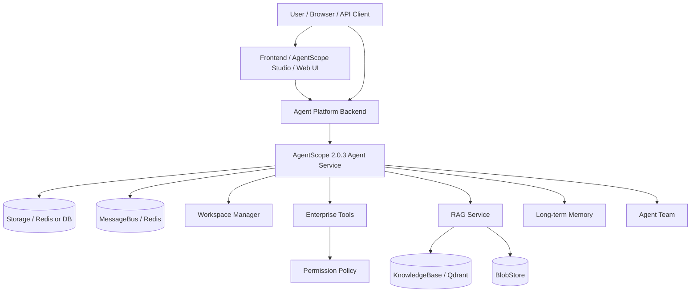
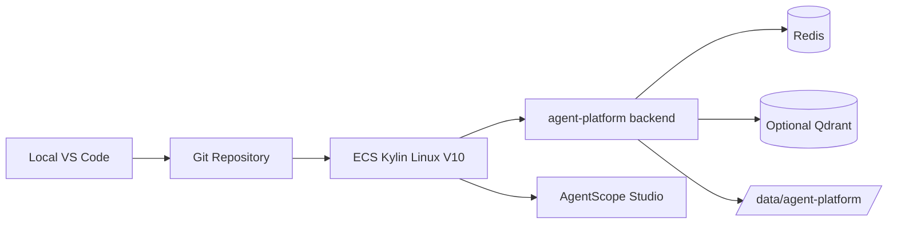

# Architecture

## Overall Architecture



## Platform Principle

Agent 是模板，Session 是运行状态。

- Agent 定义模型、工具、权限、中间件、RAG、Memory、Team 等能力。
- Session 承载一次运行时状态，包括上下文、消息、事件、Workspace 和执行过程。
- 所有核心对象都必须考虑 `tenant_id`、`user_id`、`agent_id`、`session_id` 的隔离边界。

## User / Tenant

Tenant 是企业级资源边界。User 属于 Tenant。第一阶段使用 `X-User-ID` 和 `X-Tenant-ID` 模拟身份，后续替换为 JWT / OAuth / 企业统一登录。

## Credential

Credential 用于管理模型供应商和外部系统凭证，例如 DashScope、DeepSeek、OpenAI compatible API。真实密钥不能写入代码，只能放入 `.env`、ECS 密钥系统或后续平台 Credential 服务。

## Agent

Agent 是模板对象。它不代表某一次运行，而是描述：

- 默认模型和模型参数
- 可用工具
- 可用知识库
- 长期记忆策略
- 中间件和治理策略
- Workspace 策略
- Agent Team worker 配置

## Session

Session 是 Agent 的运行状态。一个 Agent 可以有多个 Session，不同用户和租户之间必须隔离。Session 后续承载 Chat、SSE、Message History、Workspace 和 Worker Session 关系。

## Message / Event / SSE

Message 是历史消息记录。Event 是运行时事件，例如模型 token、工具调用、计划更新、错误、状态变更等。SSE 用于向前端实时推送 Event。

## Workspace

开发阶段可使用本地目录隔离：

```text
WORKSPACE_BASEDIR/user_id/agent_id
```

企业阶段建议使用更完整隔离：

```text
WORKSPACE_BASEDIR/tenant_id/user_id/agent_id/session_id
```

后续可接 AgentScope LocalWorkspaceManager、DockerWorkspaceManager 或 E2B Workspace。

## Tool / Permission

Tool 是企业能力挂载点。Permission 是工具和数据访问控制。

后续工具示例：

- CRM 查询
- 工单系统
- 数据库只读查询
- RAG 检索
- Workspace 文件读取

权限策略必须在工具执行前校验，并在执行后记录审计。

## Middleware

Middleware 用于平台治理。规划包括：

- TracingMiddleware
- BudgetControlMiddleware
- TenantContextMiddleware
- ToolAuditMiddleware
- RAGMiddleware
- Mem0LongTermMemoryMiddleware

## RAG Service

RAG 是平台能力之一，不是项目本体。后续接入：

- KnowledgeBase
- Document
- QdrantStore
- CollectionPerKbManager
- Parser
- Chunker
- LocalBlobStore / OSS / S3 / MinIO
- Async index worker

## Long-term Memory

长期记忆默认关闭。后续可按 Agent 开启 `static_control` 或 `agent_control`。不能自动保存敏感信息，必须支持租户隔离、用户删除、审计和保留策略。

## Agent Team

Agent Team 基于 Agent Service。Leader Session 可以派生 Worker Session。后续通过 SubAgentTemplate 注册 worker 类型：

- explorer
- coder
- tester
- reviewer

## Storage / MessageBus

第一阶段预留 storage 和 message_bus。后续建议：

- RedisStorage / DB Storage 用于 Agent Service 元数据和状态。
- RedisMessageBus 用于事件和 SSE 推送。

## ECS Deployment Topology


